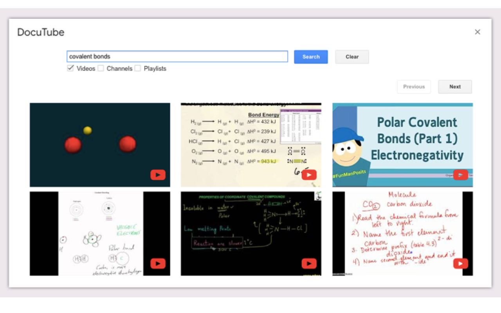
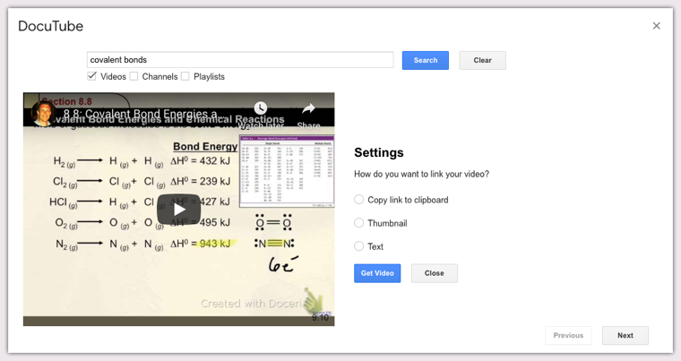

# DocuTube - Addon for Google Docs</h1>

---

## Why DocuTube?

[DocuTube](https://chrome.google.com/webstore/detail/docutube/ejgghfpikoafgmcmlplhenanbeoljlpj) makes finding, embedding, and watching videos in Google Docs manageable.

## Did you say "finding?"

You bet I did.
DocuTube now includes YouTube searching right from the Add On! Type in your search term and select what kind of search result you want. DocuTube does the rest.

## Can I preview a video?

Absolutely.
Clicking on a search result will load a small preview so you can watch and make sure it's the right one. If you're happy, you can choose how to get your video:
 
 - Copy the link to your clipboard
 - Insert and link the video thumbnail in the doc
 - Insert and link custom text

## Wow! How do I watch videos?

Easy.
DocuTube's Watch mode loads any linked video in the document in the sidebar. You can watch videos without leaving your document! It even includes videos linked in comments, which is great for student feedback.

## I'm in. Where can I get it?
You can try the Addon your self by [installing the addon here](https://chrome.google.com/webstore/detail/docutube/ejgghfpikoafgmcmlplhenanbeoljlpj). DocuTube is also available in the GSuite Marketplace.

[Privacy and Terms](https://dev.ohheybrian.com/privacy)
