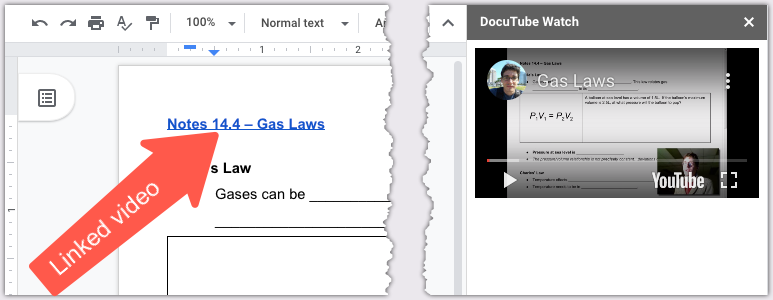

# DocuTube Viewer - Addon for Google Docs</h1>

---

## Why DocuTube Viewer?

Google Docs doesn't allow you to embed videos directly like you can with Slides.
DocuTube Viewer reads your document and finds links to YouTube videos.

DocuTube Viewer loads any linked YouTube video in the document in the sidebar.
You can watch videos without leaving your document! It even includes videos
linked in comments, which is great for student feedback.

## I'm in. Where can I get it?

DocuTube is currently under review for the Google Apps Marketplace, so you can't
install it from there yet. In the meantime, you can copy this repo into your own
script editor and try it yourself.

[Homepage](https://ohheybrian.com/docutube)
[Privacy and Terms](https://dev.ohheybrian.com/privacy/docutube.html)
